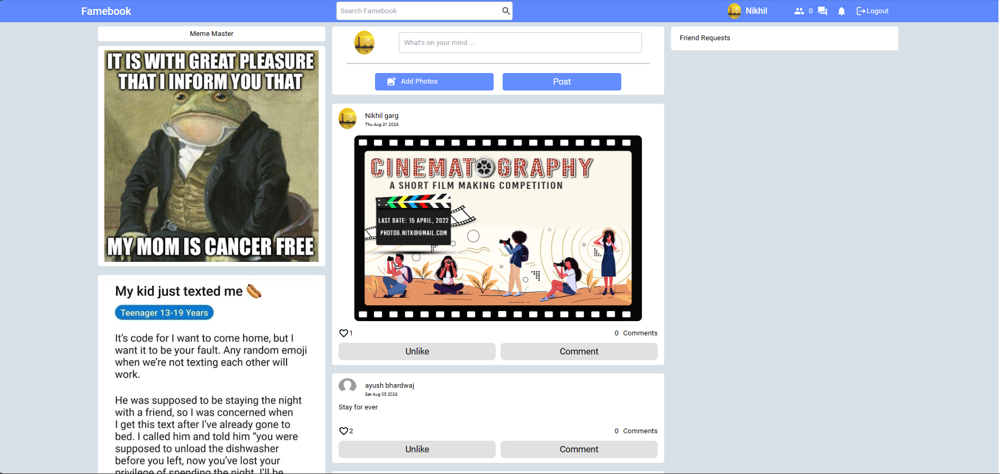

# Social Media App
## A MERN based fullstack project.
- Tools & Technbologies: React.js, MongoDB, Express, Node, Javascript present
- Features: Authentication, User Login/Logout, Like, Post, Comment on Posts, Send/Recieve friend Request, Single User Usage with Security and Routing defined.
- Used an External API to display new Memes.
- Extensive use of React Hooks, Contexts, Logics.
